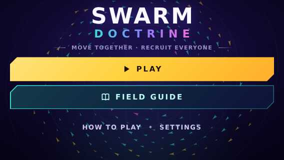

# Keep landscape home actions visible: evidence

Base: `2e10c82981c8c77e2f51c77205aca0e7ad3947e5`. Date: 2026-10-09.

At 844x390 the home hero was 492.8px tall and Settings ended at y=468.8, outside the screen. Added a height-aware landscape home layout with a two-column layout at >=640px and a compact stacked fallback. All visible home buttons fit at five tested sizes.

This PR fixes the home screen. A follow-up browser audit also checked mode, Settings and team pages plus the in-game HUD, coach, details, pause and result surfaces. Across the same five viewports, 45 states had no horizontal overflow, out-of-bounds interactive elements or HUD collisions. Tall page content and the details sheet remain vertically scrollable on short screens. This finite browser matrix is evidence for these surfaces, not a claim about every device. No gameplay or field-guide imagery changes.

Reproduce unit checks: `npm ci && npm run check && npm test && npm run build`.

## Screenshots

Before 844×390:

After 844×390:

Portrait 390×844:

Compact landscape 568×320:

Measurements for 390×844, 844×390, 640×360, 568×320 and 1280×720 are in [measurements.json](measurements.json). Reproduce by opening the production preview at those sizes and checking bounding boxes of the four home actions; all edges must remain inside the viewport.

The [45-state layout matrix](layout-matrix.json) uses those same sizes. It opens Home, mode, Settings and team screens, then a Hard duel with HUD, coach, details, pause and result states. It asserts that each visible interactive element stays within the horizontal viewport and that the pause/status/HUD action groups do not overlap.

Logs: [type checks](check.log), [tests](test.log), [build](build.log).
